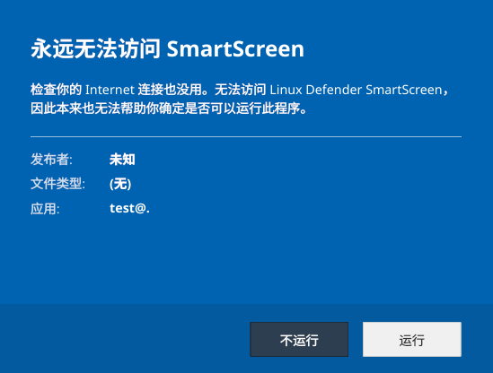

# Linux Defender SmartScreen

为Linux添加了Defender Smartscreen，一点也没添加了无与伦比的安全性，在此基础上仍然没有强大的易用性



```txt
Linux Defender SmartScreen 不可防止网络钓鱼或恶意软件的网站和应用程序以及潜在恶意文件的下载。

Linux Defender SmartScreen 可通过以下方法确定某站点是否为潜在恶意网站：

    无

Linux Defender SmartScreen 可通过以下方法确定已下载应用或应用安装程序是否为潜在恶意软件：

    无
```

## 组件

| 组件                       | 说明                               |
| ------------------------ | -------------------------------- |
| `smartscreend`           | 守护进程，监控 `~/Downloads`，自动标记新可执行文件 |
| `smartscreen-dialog`     | Qt 确认弹窗，用户选择允许/阻止                |
| `libsmartscreen_hook.so` | LD_PRELOAD 共享库，拦截 exec 调用并弹窗     |

## 原理

- 仅标记有执行权限的文件
- `file.txt` → `file@.txt`
- `.bashrc` → `.@.bashrc`
- `noext` → `noext@.`
- 用户允许后：`file@.txt` → `file#.txt`（`#` 表示已放行，不再拦截）

## 使用

打开编译和安装脚本（不会有人真装吧

```bash
./build.sh
./install.sh
```

依赖：cmake、g++、Qt6 Widgets

## CLI调试工具

```bash
smartscreend                    # 启动守护进程
smartscreend --check <file>     # 检查文件是否有标签
smartscreend --tag <file>       # 手动标记
smartscreend --untag <file>     # 移除标签
```
